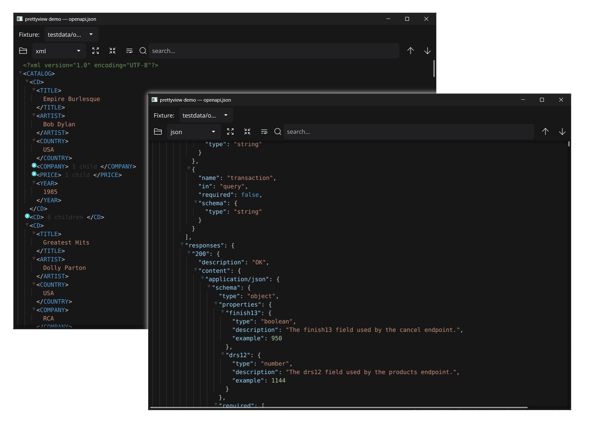

# go-fyne-pretty-view

[](https://github.com/ideaconnect/go-fyne-pretty-view/actions/workflows/ci.yml)
[](https://codecov.io/gh/ideaconnect/go-fyne-pretty-view)
[](https://pkg.go.dev/github.com/ideaconnect/go-fyne-pretty-view)
[](https://goreportcard.com/report/github.com/ideaconnect/go-fyne-pretty-view)
[](go.mod)
[](LICENSE)

A memory-efficient, virtualized [Fyne](https://fyne.io) widget for viewing
structured data — **JSON, JSONC, XML, HTML, and raw text** — in the style of
[Bruno](https://www.usebruno.com)'s response viewer.



## Contents

- [Features](#features)
- [Why it stays small](#why-it-stays-small)
- [Install](#install)
- [Quick start](#quick-start)
- [Functionality and how to toggle it](#functionality-and-how-to-toggle-it)
- [Construction options](#construction-options)
- [Controls: built-in, your own, or both](#controls-built-in-your-own-or-both)
- [Key methods](#key-methods)
- [Theming](#theming)
- [Threading](#threading)
- [Demo](#demo)
- [Design and documentation](#design-and-documentation)
- [Contributing](#contributing)
- [Sponsorship](#sponsorship)
- [Credits and third-party licenses](#credits-and-third-party-licenses)
- [License](#license)

## Features

- **Syntax highlighting** for JSON / JSONC / XML / HTML, with a dark/light palette you can override. (JSONC `//` and `/* */` comments render as their own nodes — visible, searchable, copyable.)
- **Auto-detection** of the input format, with a raw-text fallback for anything else (or malformed input).
- **Expand / fold** every container, with a collapse summary on folded nodes (`{ 38 items }`, `[ 3 items ]`, `<tag> 5 children`).
- **True character-level free-text selection** across rows, with exact-substring copy (`Ctrl/Cmd+C`) and select-all (`Ctrl/Cmd+A`).
- **Right-click context menu** (Copy / Select all) — the standard Fyne pop-up menu, the same one Fyne's own text widgets use.
- **Copy a whole section** (subtree) to the clipboard, regardless of fold state.
- **Search** with plain or regular-expression matching, case sensitivity, match navigation, and **auto-reveal into folded nodes**.
- **Soft word-wrap** (toggleable): long lines wrap to the viewport width at word boundaries, or scroll horizontally — selection, search, and copy still operate on whole logical lines.
- **Keyboard navigation**: arrows, `PageUp`/`PageDown`, `Home`/`End`, `Esc` to clear the selection, `Ctrl/Cmd+F` to focus search.
- **Optional, à-la-carte controls**: a built-in toolbar (Open, format, expand/collapse, wrap, search) you can enable control-by-control — or drive everything from your own widgets via the public API.

## Why it stays small

The widget is built around a hard memory bound: **only the rows currently
visible in the viewport ever exist as live canvas objects.** Everything else
lives in a compact, pointer-free, struct-of-arrays model, and selection, search
and copy all operate on that model rather than on widgets.

Measured on the included fixtures:

| Input | Visible rows | Live row widgets | Heap after scrolling the whole file |
|---|---|---|---|
| `big.json` (7.5 MB) | 440,005 | **31** | **~80–90 MB** |

The parsed model is roughly **5× to over 7× the source size** — about 4.85× for
typical pretty-printed JSON (the ~478 KB `openapi.json` → ~2.2 MB, guarded by
`TestModelSizeRatio`), rising to ~7.1× for documents dominated by short structural
lines (the 7.5 MB `big.json` → ~51 MB), since each line and segment carries a
fixed-size record. A single multi-megabyte line
is horizontally culled so no individual text
texture is ever wider than the viewport (without that, Fyne would try to
rasterize a ~1 GB bitmap for the line).

## Install

```sh
go get github.com/ideaconnect/go-fyne-pretty-view
```

Requires Go 1.26.4+ and the usual Fyne build dependencies (a C compiler and the
OpenGL/X11 headers on Linux).

## Quick start

```go
import (
    "fyne.io/fyne/v2/app"
    prettyview "github.com/ideaconnect/go-fyne-pretty-view"
)

func main() {
    a := app.New()
    w := a.NewWindow("viewer")

    pv := prettyview.New()
    pv.SetData(jsonBytes, prettyview.FormatAuto) // or FormatJSON/FormatJSONC/FormatXML/FormatHTML/FormatRaw

    w.SetContent(pv)
    w.ShowAndRun()
}
```

The widget itself is just the viewer — it has **no built-in buttons**. Add the
optional toolbar (or your own controls) as shown under
[Controls](#controls-built-in-your-own-or-both).

## Functionality and how to toggle it

Everything the viewer can do, and how to turn it on or off. The core viewing
behaviors are **always on**; behavior is tuned with construction `Option`s or the
matching runtime setters; the on-screen chrome is **entirely opt-in**.

### Viewer behavior

| Capability | Default | How to change it |
|---|---|---|
| Syntax highlighting | On | Always on; recolor with `WithTheme` / `SetTheme` (use `FormatRaw` for plain, unhighlighted text). |
| Input format | Auto-detect | `WithFormat(f)` at build, or `SetData(src, f)` / `Reparse(f)` / `SetText(s)` at runtime. |
| Expand / fold a node | On (click the triangle) | Always available; `ExpandAll()` / `CollapseAll()` programmatically. |
| Initial collapse depth | Fully expanded (`0`) | `WithDefaultCollapseDepth(d)` at build, or `SetDefaultCollapseDepth(d)` at runtime. |
| Free-text selection & copy | On | Always on; `SelectAll()`, `SelectedText()`, `CopySelection()`, `ClearSelection()`, `Ctrl/Cmd+A`, `Ctrl/Cmd+C`. |
| Right-click context menu | On | Always on (Copy / Select all). |
| Copy a subtree | On demand | `CopySubtree(byteOffset) bool` (JSON/JSONC only; copies the pretty-printed subtree). |
| Search | On demand | `Search(SearchQuery{Text, Mode, CaseSensitive})`, `SearchNext()`, `SearchPrev()`, `ClearSearch()`, `SearchStatus()`. Tune with `WithSearchConfig(...)`. |
| Soft word-wrap | Off (`WrapNone`) | `WithWrap(WrapWord)` at build, or `SetWrap(WrapWord)` / `SetWrap(WrapNone)` at runtime; `Wrap()` reads it. |
| Tab display width | `4` | `WithTabWidth(n)`. |
| Indent step (px/level) | `16` | `WithIndentStep(px)`. |
| Theme / colors | Track the host Fyne theme | `WithTheme` / `WithSyntaxColors` at build; `SetTheme` / `SetSyntaxColors` at runtime. |
| Keyboard navigation | On | Always on (arrows, `PageUp`/`PageDown`, `Home`/`End`, `Esc`). |

`SearchQuery.Mode` is `SearchPlain` (default) or `SearchRegex`; matches are capped
by `SearchConfig.MaxMatches` (10 000 by default) and revealed even inside folded
nodes.

### Built-in controls (all opt-in)

The toolbar is assembled from `ToolbarConfig` — every control is a `Show*` flag,
so you include exactly the ones you want:

| Control | Flag | Notes |
|---|---|---|
| Open file | `ShowOpen` | Needs `Window` (built-in file dialog) **or** `OnOpen` (your own handler). |
| Format selector | `ShowFormat` | auto / json / jsonc / xml / html / raw; re-parses the current source. |
| Expand all / Collapse all | `ShowExpandCollapse` | |
| Word-wrap toggle | `ShowWrap` | Highlighted while wrapping is on. |
| Search bar | `ShowSearch` | Find box, prev/next, live match counter. |
| `Ctrl/Cmd+F` focuses search | set `Window` | Registered when a `Window` is supplied. |

Each control is also available à la carte (`NewSearchBar`, `NewFormatSelect`,
`NewFoldButtons`, `NewWrapToggle`) so you can place it anywhere, and host widgets
can stay in sync via `SetOnSearchChanged` and `SetOnDataChanged`.

## Construction options

```go
pv := prettyview.New(
    prettyview.WithFormat(prettyview.FormatJSON),       // skip auto-detect
    prettyview.WithWrap(prettyview.WrapWord),           // soft-wrap long lines (or WrapNone to scroll, default)
    prettyview.WithDefaultCollapseDepth(3),             // collapse containers at depth 3 and deeper on load
    prettyview.WithIndentStep(16),                      // pixels per nesting level
    prettyview.WithTabWidth(4),
    // WithSearchConfig replaces the search config wholesale — set DebounceFor
    // explicitly, or keystroke search is not coalesced (it scans on every keystroke).
    prettyview.WithSearchConfig(prettyview.SearchConfig{MaxMatches: 5000, DebounceFor: 150 * time.Millisecond}),
)
```

`NewWithData(src, format, opts...)` is the one-shot form that constructs and loads
in a single call.

## Controls: built-in, your own, or both

The package *optionally* provides ready-made controls bound to a `PrettyView`;
every control is individually opt-in, so a host app can use the provided ones
as-is, disable them and drive the public API from its own widgets, or mix the two.

```go
pv := prettyview.New()

// (a) Drop in the built-in control bar — pick exactly which controls appear.
bar := prettyview.NewToolbar(pv, prettyview.ToolbarConfig{
    ShowOpen:           true,   // "Open…" file dialog (needs Window or OnOpen)
    ShowFormat:         true,   // format selector (re-parses current source)
    ShowExpandCollapse: true,   // Expand all / Collapse all
    ShowWrap:           true,   // soft-wrap toggle
    ShowSearch:         true,   // find box + prev/next + match counter
    Window:             w,      // enables the Open dialog and Ctrl/Cmd+F focus
})
w.SetContent(container.NewBorder(bar, nil, nil, nil, pv))
```

```go
// (b) Or omit the toolbar and wire your own controls to the public API. Use
// SearchDebounced (not Search) for per-keystroke input so a burst coalesces into one
// scan — it honors SearchConfig.DebounceFor (set it via WithSearchConfig).
myFind.OnChanged        = func(s string) { pv.SearchDebounced(prettyview.SearchQuery{Text: s}) }
myExpandButton.OnTapped = pv.ExpandAll
```

`prettyview.DefaultToolbarConfig()` returns a config with every control enabled.
À-la-carte constructors let you place individual built-ins anywhere:
`prettyview.NewSearchBar(pv)`, `prettyview.NewFormatSelect(pv)`,
`prettyview.NewFoldButtons(pv)`, `prettyview.NewWrapToggle(pv)`. To keep host
controls in sync, register `pv.SetOnSearchChanged(fn)` (match counter),
`pv.SetOnDataChanged(fn)` (format), and `pv.SetOnSearchRequested(fn)` (focus the
search box, e.g. on `Ctrl/Cmd+F`).

> **Note on the file dialog:** the built-in *Open* uses **Fyne's own** in-canvas
> file browser, not the OS-native picker (Fyne draws all its UI on the GL canvas).
> For a platform-native dialog, set `ToolbarConfig.OnOpen` to your own picker and
> feed the bytes to `pv.SetData`.

## Key methods

| Method | Purpose |
|---|---|
| `SetData(src, format)` / `SetText(s)` | load content |
| `Reparse(format)` / `Source()` / `Format()` | re-parse the current bytes / read them back / current format |
| `ExpandAll()` / `CollapseAll()` / `SetDefaultCollapseDepth(d)` | fold control |
| `ExpandTo(byteOffset) bool` | reveal & scroll to a node (JSON/JSONC only; returns false on XML/HTML, which lack source offsets) |
| `SelectAll()` / `ClearSelection()` / `SelectedText()` | selection |
| `CopySelection()` / `CopySubtree(byteOffset) bool` | clipboard (CopySubtree is JSON/JSONC only and copies the pretty-printed subtree; returns false on XML/HTML) |
| `Search(SearchQuery{...})` / `SearchNext()` / `SearchPrev()` / `ClearSearch()` / `SearchStatus()` | search |
| `SetWrap(WrapWord/WrapNone)` / `Wrap()` | soft-wrap long lines to the viewport, or scroll |
| `SetTheme(variant, Theme{...})` / `SetSyntaxColors(variant, SyntaxColors{...})` | theming (all colors / syntax-only) |
| `SetOnSearchRequested(fn)` / `SetOnSearchChanged(fn)` / `SetOnDataChanged(fn)` | host hooks (focus search, sync counter, sync format) |

## Theming

The viewer ships a built-in dark/light palette (`theme.go`), but every color is
overridable. The structural colors (foreground, selection, indent guides) default
to tracking the host Fyne theme, so an un-themed viewer blends into your app.

```go
import "fyne.io/fyne/v2/theme"

pv := prettyview.New(
    // Override any subset of colors for a variant; nil fields keep the default.
    prettyview.WithTheme(theme.VariantDark, prettyview.Theme{
        Key:         myKeyColor,
        String:      myStringColor,
        Selection:   mySelectionFill,   // free-text selection fill
        Match:       myMatchFill,        // search highlight
        ActiveMatch: myActiveMatchFill,
        IndentGuide: myGuideColor,
    }),
)

// …or just the syntax tokens, or change it at runtime (both compose):
pv.SetSyntaxColors(theme.VariantDark, prettyview.SyntaxColors{Number: myNumberColor})
pv.SetTheme(theme.VariantLight, prettyview.Theme{Selection: myLightSelection})
```

`Theme` covers the syntax tokens (`Key`, `String`, `Number`, `Bool`, `Null`,
`Punct`, `Tag`, `Attr`, `Comment`) and the structural colors (`Foreground`,
`Summary`, `IndentGuide`, `Selection`, `Match`, `ActiveMatch`). `SyntaxColors` is
the token-only shorthand. Overrides merge, so repeated calls accumulate.

### Fonts

Fonts in Fyne are an **app-wide** setting (the theme's `Font()`), not a per-widget
one. The widget itself only renders the viewer body as monospace and otherwise
follows whatever theme your app installs — by default Fyne's bundled DejaVu Sans
Mono / Noto Sans.

The optional [`fonttheme`](fonttheme) subpackage bundles the project's preferred
faces — **JetBrains Mono** for the monospace body and **Inter** for UI text — and
wraps them as a `fyne.Theme` you install on your app:

```go
import (
    "fyne.io/fyne/v2/app"
    "fyne.io/fyne/v2/theme"
    "github.com/ideaconnect/go-fyne-pretty-view/fonttheme"
)

a := app.New()
a.Settings().SetTheme(fonttheme.New(theme.DefaultTheme()))
```

`fonttheme.New` wraps any base theme and overrides **only** its fonts, so your
base theme's colors, sizes, and icons are preserved. The fonts are embedded in the
`fonttheme` package alone — importing the core `prettyview` widget pulls in **no**
font data, so you only pay for the typefaces if you opt in.

Override individual faces (a nil field keeps the bundled default) via `WithFonts`.
Each weight is its own field, so to swap the monospace face set both `Mono` and
`MonoBold` — otherwise bold monospace would still render in JetBrains Mono:

```go
a.Settings().SetTheme(fonttheme.New(theme.DefaultTheme(), fonttheme.WithFonts(fonttheme.Fonts{
    Mono:     myMonoRegular, // swap the monospace face (UI text stays Inter)
    MonoBold: myMonoBold,    // set both weights so bold monospace matches
})))
```

You are never required to use `fonttheme`: install your own `fyne.Theme` (or none)
and the widget renders with whatever monospace face that theme provides.

## Threading

`PrettyView` follows the usual Fyne widget rule: it is **not safe for concurrent
use** — call its methods (`SetData`, `Search`, `ExpandAll`, the selection and theme
mutators, …) on the goroutine that runs the Fyne event loop. To drive it from
another goroutine (e.g. after a network fetch), marshal the call with `fyne.Do`:

```go
go func() {
    data := fetch()
    fyne.Do(func() { pv.SetData(data, prettyview.FormatAuto) })
}()
```

The widget holds no locks by design; its one internal background task — the search
debounce — already marshals back onto the Fyne goroutine.

## Demo

```sh
go run ./cmd/prettyview-demo               # loads testdata/openapi.json
go run ./cmd/prettyview-demo path/to/file  # or any file
```

The demo shows both control styles at once: the built-in `NewToolbar` (Open,
format, expand/collapse, wrap, search) used as-is, plus an app-supplied fixture
dropdown that drives the public API directly.

Prebuilt binaries are produced by CI for Linux, Windows, and macOS — each is a
zip containing the executable alongside the `testdata/` fixtures, so the fixture
dropdown works as soon as you extract and run it. Tagged versions publish these
zips to the project's [GitHub Releases](https://github.com/ideaconnect/go-fyne-pretty-view/releases)
page; CI runs also keep them as build artifacts.

## Design and documentation

The full, source-grounded architecture (the virtualization invariant, the
struct-of-arrays model, the Fenwick fold index, the char-level selection math,
and the adversarial risk analysis) lives in [docs/DESIGN.md](docs/DESIGN.md).

| File | For whom / what |
|---|---|
| [README.md](README.md) | This overview: features, install, usage, API. |
| [CHANGELOG.md](CHANGELOG.md) | Notable changes per release (Keep a Changelog). |
| [STRUCTURE.md](STRUCTURE.md) | The codebase map — every file, the layering, the mental model. |
| [WORKFLOWS.md](WORKFLOWS.md) | How to build, run, test, benchmark, and extend (parsers, colors). |
| [docs/DESIGN.md](docs/DESIGN.md) | The authoritative architecture + adversarial risk analysis. |
| [docs/PERFORMANCE.md](docs/PERFORMANCE.md) | Performance review: hot paths, benchmarks, and the measured deltas. |
| [HUMANS.md](HUMANS.md) | Onboarding and contribution guide for people. |
| [AGENTS.md](AGENTS.md) | Brief for AI coding agents: invariants to preserve, conventions. |
| [CLAUDE.md](CLAUDE.md) | Claude Code entry point (points at AGENTS.md). |

## Contributing

Contributions are welcome — issues and pull requests both. A few things keep the
project healthy:

- **Read the briefs first.** [HUMANS.md](HUMANS.md) is the human onboarding guide;
  [WORKFLOWS.md](WORKFLOWS.md) covers build/run/test/bench and how to add a parser
  or a color; [AGENTS.md](AGENTS.md) lists the non-negotiable invariants.
- **`make check` must pass.** It runs `gofmt`, `go vet` (which also forbids
  `internal/` Fyne imports), and `go test -race ./...`. CI additionally enforces
  **> 90 % coverage**, so ship a regression test with each change.
- **Respect the memory invariants.** Only viewport-many rows are ever live
  widgets; selection/search/copy operate on the model, not on widgets; per-row
  text is horizontally culled. The arena sizes (`Node`=32 B, `Line`=24 B,
  `Segment`=12 B) are locked by `internal/model/sizes_test.go`. If a change
  regresses `renderer_test.go` or `memory_test.go`, it's the change that's wrong.
- **See the UI without a display.** `make shots` renders the fixtures to PNGs via
  Fyne's software painter, so you can verify layout/colors/highlight z-order
  headlessly.
- Keep changes milestone-sized and ship the test in the same change.

## Sponsorship

This project is maintained on the side and looking for sponsors to keep the
modernization moving forward. If your team relies on it, please consider chipping
in ❤️ — every contribution helps keep this library alive:

[](https://github.com/sponsors/ideaconnect) [](https://buymeacoffee.com/idct)

Thank you to everyone who already supports the project! 🙏

## Credits and third-party licenses

This repository vendors third-party assets. Their license texts are kept next to
the files, and the obligations below are summarized for convenience — the bundled
license texts are authoritative.

**Toolbar glyphs — [Font Awesome Free](https://fontawesome.com)** (open,
expand/collapse, wrap-text, search, up/down). The icons are used under the
**CC BY 4.0** license; © Fonticons, Inc. The SVGs are vendored under
[icons/fontawesome/](icons/fontawesome/) with the full license at
[icons/fontawesome/LICENSE.txt](icons/fontawesome/LICENSE.txt), and each SVG keeps
Font Awesome's original attribution comment. They are recolored to the active
theme foreground when the resource is built.

**Bundled fonts (optional, [`fonttheme`](fonttheme) only)** — both under the
**SIL Open Font License 1.1**:

- **JetBrains Mono** (monospace) — © The JetBrains Mono Project Authors;
  [fonttheme/fonts/JetBrainsMono/OFL.txt](fonttheme/fonts/JetBrainsMono/OFL.txt).
- **Inter** (UI text) — © The Inter Project Authors;
  [fonttheme/fonts/Inter/LICENSE.txt](fonttheme/fonts/Inter/LICENSE.txt).

These fonts are embedded only in the `fonttheme` subpackage; the core widget
bundles no fonts.

### If your software uses this library

You inherit obligations only for the assets you actually ship:

- **Font Awesome icons (CC BY 4.0).** The icons are compiled into every binary
  that links the widget (they are tiny embedded SVGs). CC BY 4.0 requires
  **attribution** — credit "Font Awesome Free" with a link to
  <https://fontawesome.com> and to the license. The simplest way to comply is to
  keep [icons/fontawesome/LICENSE.txt](icons/fontawesome/LICENSE.txt) in your
  distribution (or reproduce its attribution notice in your app's about/credits).

- **JetBrains Mono / Inter (SIL OFL 1.1).** You incur these obligations **only if
  you import the `fonttheme` subpackage**, which embeds the font files into your
  binary. The OFL permits bundling and redistribution; it asks that you **include
  the OFL license text** with the fonts and **not sell the fonts on their own**.
  Keeping the two `OFL.txt` / `LICENSE.txt` files (or their text in your credits)
  satisfies this. If you do **not** import `fonttheme`, you ship no fonts and have
  nothing to attribute here.

If you do not use `fonttheme` and you reproduce Font Awesome's attribution
elsewhere, you can ship without bundling any of these license files — but vendoring
them is the easiest path to compliance. For a concrete example, the prebuilt demo
zips (which embed both the icons and the fonts) carry these three license texts
under a `licenses/` folder alongside the binary.

## License

This library's own code is licensed under the
[BSD 3-Clause License](LICENSE) (© 2026 IDCT, Bartosz Pachołek). The third-party
assets above keep their respective licenses.
