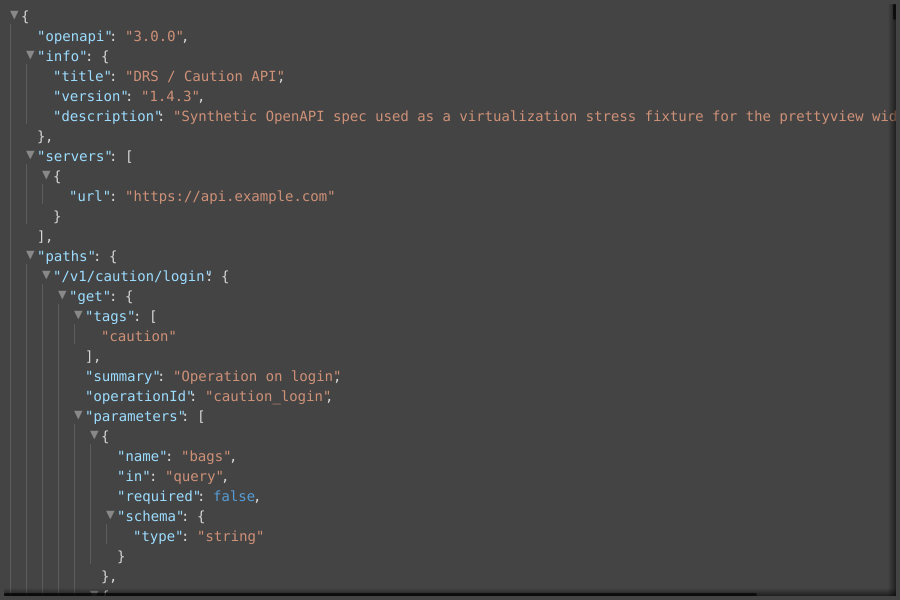

# go-fyne-pretty-view

A memory-efficient, virtualized [Fyne](https://fyne.io) widget for viewing
structured data — **JSON, JSONC, XML, HTML, and raw text** — in the style of
[Bruno](https://www.usebruno.com)'s response viewer.



## Features

- **Syntax highlighting** for JSON / XML / HTML, with a dark/light palette you can override.
- **Expand / fold** every container, with a collapse summary on folded nodes (`{ 38 items }`, `[ 3 items ]`, `<tag> 5 children`).
- **Copy a whole section** (subtree) to the clipboard.
- **True character-level free-text selection** across rows, with exact-substring copy (`Ctrl/Cmd+C`) and select-all (`Ctrl/Cmd+A`).
- **Search** with plain or regular-expression matching, match navigation, and **auto-reveal into folded nodes**.
- **Auto-detection** of the input format, with a raw-text fallback for anything else (or malformed input).

## Why it stays small

The widget is built around a hard memory bound: **only the rows currently
visible in the viewport ever exist as live canvas objects.** Everything else
lives in a compact, pointer-free, struct-of-arrays model, and selection, search
and copy all operate on that model rather than on widgets.

Measured on the included fixtures:

| Input | Visible rows | Live row widgets | Heap after scrolling the whole file |
|---|---|---|---|
| `big.json` (7.5 MB) | 440,005 | **31** | **~80 MB** |

The parsed model is about **5× the source size** (e.g. a 467 KB JSON → ~2.3 MB),
and a single multi-megabyte line is horizontally culled so no individual text
texture is ever wider than the viewport (without that, Fyne would try to
rasterize a ~1 GB bitmap for the line).

## Install

```sh
go get github.com/ideaconnect/go-fyne-pretty-view
```

Requires Go 1.26+ and the usual Fyne build dependencies (a C compiler and the
OpenGL/X11 headers on Linux).

## Usage

```go
import (
    "fyne.io/fyne/v2/app"
    prettyview "github.com/ideaconnect/go-fyne-pretty-view"
)

func main() {
    a := app.New()
    w := a.NewWindow("viewer")

    pv := prettyview.New()
    pv.SetData(jsonBytes, prettyview.FormatAuto) // or FormatJSON/FormatXML/FormatHTML/FormatRaw

    w.SetContent(pv)
    w.ShowAndRun()
}
```

### Construction options

```go
pv := prettyview.New(
    prettyview.WithFormat(prettyview.FormatJSON),       // skip auto-detect
    prettyview.WithWrap(prettyview.WrapNone),           // long lines scroll horizontally (default)
    prettyview.WithDefaultCollapseDepth(3),             // auto-collapse below depth 3 on load
    prettyview.WithIndentStep(16),                      // pixels per nesting level
    prettyview.WithTabWidth(4),
    prettyview.WithSearchConfig(prettyview.SearchConfig{MaxMatches: 5000}),
)
```

### Theming

The viewer ships a built-in dark/light palette (`theme.go`), but every color is
overridable. The structural colors (foreground, selection, indent guides) default
to tracking the host Fyne theme, so an un-themed viewer blends into your app.

```go
import "fyne.io/fyne/v2/theme"

pv := prettyview.New(
    // Override any subset of colors for a variant; nil fields keep the default.
    prettyview.WithTheme(theme.VariantDark, prettyview.Theme{
        Key:         myKeyColor,
        String:      myStringColor,
        Selection:   mySelectionFill,   // previously not customizable
        Match:       myMatchFill,        // search highlight
        ActiveMatch: myActiveMatchFill,
        IndentGuide: myGuideColor,
    }),
)

// …or just the syntax tokens, or change it at runtime (both compose):
pv.SetSyntaxColors(theme.VariantDark, prettyview.SyntaxColors{Number: myNumberColor})
pv.SetTheme(theme.VariantLight, prettyview.Theme{Selection: myLightSelection})
```

`Theme` covers the syntax tokens (`Key`, `String`, `Number`, `Bool`, `Null`,
`Punct`, `Tag`, `Attr`, `Comment`) and the structural colors (`Foreground`,
`Summary`, `IndentGuide`, `Selection`, `Match`, `ActiveMatch`). `SyntaxColors` is
the token-only shorthand. Overrides merge, so repeated calls accumulate.

### Controls: use the built-ins, hook your own, or both

The widget itself is just the viewer — it has **no built-in buttons**. The package
*optionally* provides ready-made controls bound to a `PrettyView`; every control
is individually opt-in, so a host app can use the provided ones as-is, disable
them and drive the public API from its own widgets, or mix the two.

```go
pv := prettyview.New()

// (a) Drop in the built-in control bar — pick exactly which controls appear.
bar := prettyview.NewToolbar(pv, prettyview.ToolbarConfig{
    ShowOpen:           true,   // "Open…" file dialog (needs Window or OnOpen)
    ShowFormat:         true,   // format selector (re-parses current source)
    ShowExpandCollapse: true,   // Expand all / Collapse all
    ShowSearch:         true,   // find box + prev/next + match counter
    Window:             w,      // enables the Open dialog and Ctrl/Cmd+F focus
})
w.SetContent(container.NewBorder(bar, nil, nil, nil, pv))
```

```go
// (b) Or omit the toolbar and wire your own controls to the public API:
myFind.OnChanged   = func(s string) { pv.Search(prettyview.SearchQuery{Text: s}) }
myExpandButton.OnTapped = pv.ExpandAll
```

À-la-carte constructors let you place individual built-ins anywhere:
`prettyview.NewSearchBar(pv)`, `prettyview.NewFormatSelect(pv)`,
`prettyview.NewFoldButtons(pv)`. To keep host controls in sync, register
`pv.SetOnSearchChanged(fn)` (match counter) and `pv.SetOnDataChanged(fn)` (format).

### Key methods

| Method | Purpose |
|---|---|
| `SetData(src, format)` / `SetText(s)` | load content |
| `Reparse(format)` / `Source()` | re-parse the current bytes under another format / read them back |
| `ExpandAll()` / `CollapseAll()` | fold control |
| `ExpandTo(byteOffset)` | reveal & scroll to a node |
| `SelectAll()` / `ClearSelection()` / `SelectedText()` | selection |
| `CopySelection()` / `CopySubtree(byteOffset)` | clipboard |
| `Search(SearchQuery{...})` / `SearchNext()` / `SearchPrev()` / `SearchStatus()` | search |
| `SetTheme(variant, Theme{...})` / `SetSyntaxColors(variant, SyntaxColors{...})` | theming (all colors / syntax-only) |
| `SetOnSearchRequested(fn)` / `SetOnSearchChanged(fn)` / `SetOnDataChanged(fn)` | host hooks (focus search, sync counter, sync format) |

### Threading

`PrettyView` follows the usual Fyne widget rule: it is **not safe for concurrent
use** — call its methods (`SetData`, `Search`, `ExpandAll`, the selection and theme
mutators, …) on the goroutine that runs the Fyne event loop. To drive it from
another goroutine (e.g. after a network fetch), marshal the call with `fyne.Do`:

```go
go func() {
    data := fetch()
    fyne.Do(func() { pv.SetData(data, prettyview.FormatAuto) })
}()
```

The widget holds no locks by design; its one internal background task — the search
debounce — already marshals back onto the Fyne goroutine.

## Demo

```sh
go run ./cmd/prettyview-demo               # loads testdata/openapi.json
go run ./cmd/prettyview-demo path/to/file  # or any file
```

The demo shows both control styles at once: the built-in `NewToolbar` (Open,
format, expand/collapse, search) used as-is, plus an app-supplied fixture
dropdown that drives the public API directly.

## Design

The full, source-grounded architecture (the virtualization invariant, the
struct-of-arrays model, the Fenwick fold index, the char-level selection math,
and the adversarial risk analysis) lives in [docs/DESIGN.md](docs/DESIGN.md).

## Documentation

| File | For whom / what |
|---|---|
| [README.md](README.md) | This overview: features, install, usage, API. |
| [STRUCTURE.md](STRUCTURE.md) | The codebase map — every file, the layering, the mental model. |
| [WORKFLOWS.md](WORKFLOWS.md) | How to build, run, test, benchmark, and extend (parsers, colors). |
| [docs/DESIGN.md](docs/DESIGN.md) | The authoritative architecture + adversarial risk analysis. |
| [HUMANS.md](HUMANS.md) | Onboarding and contribution guide for people. |
| [AGENTS.md](AGENTS.md) | Brief for AI coding agents: invariants to preserve, conventions. |
| [CLAUDE.md](CLAUDE.md) | Claude Code entry point (points at AGENTS.md). |

## License

Licensed under the [BSD 4-Clause License](LICENSE) (© 2026 IDCT, Bartosz Pachołek).

> **Note:** BSD-4-Clause retains the original "advertising clause" and is
> [GPL-incompatible](https://www.gnu.org/licenses/license-list.html#OriginalBSD).
> If you need GPL compatibility or a simpler license, open an issue — we can move to
> BSD-3-Clause or MIT.
