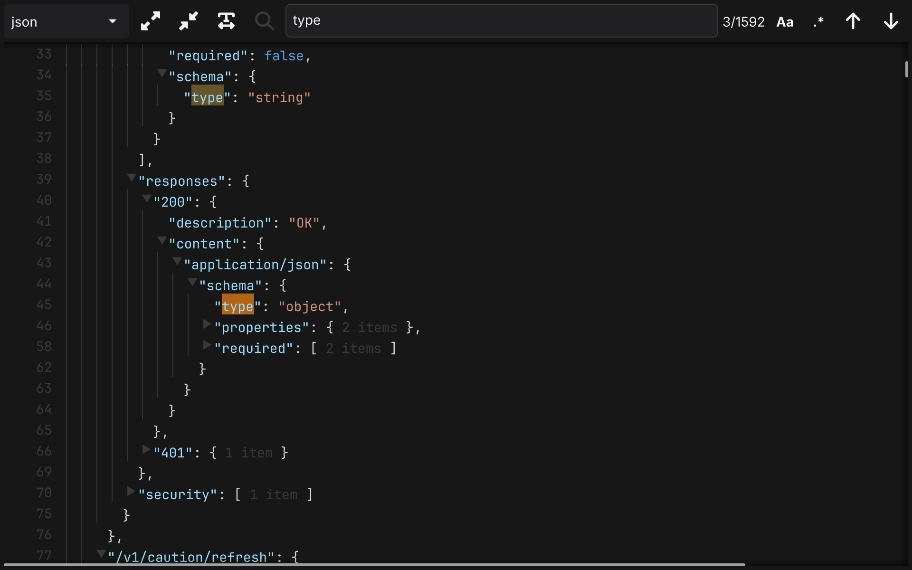
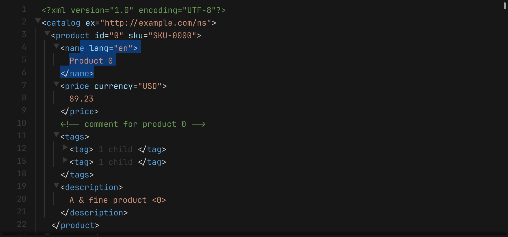
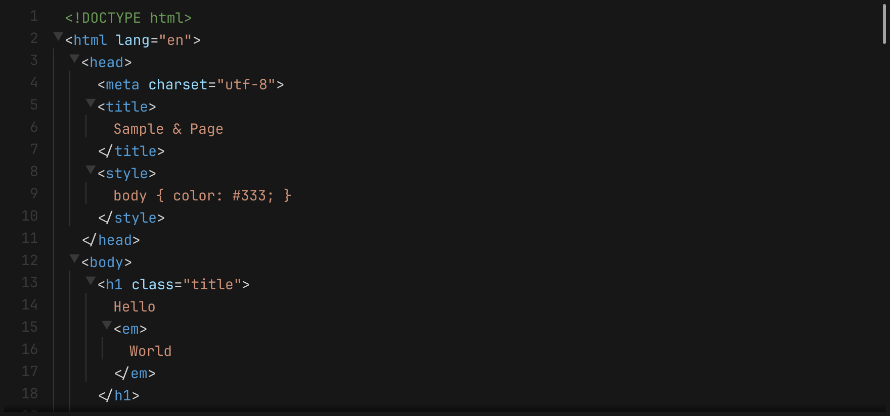
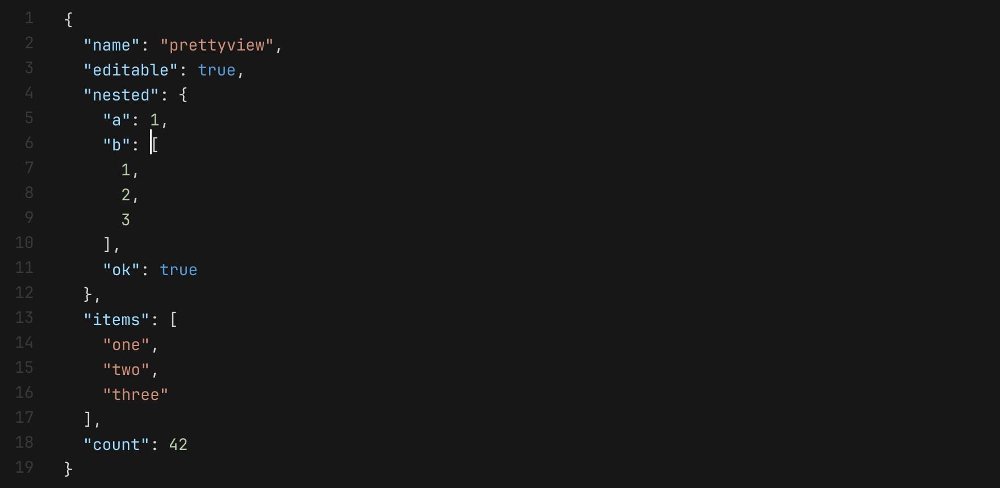
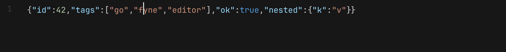
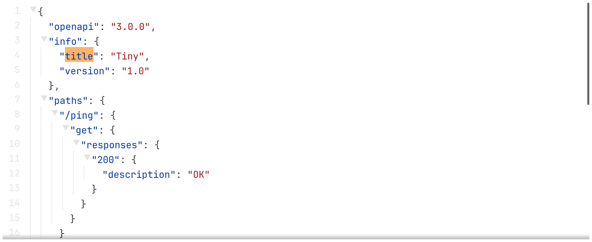

# go-fyne-pretty-view

[](https://github.com/ideaconnect/go-fyne-pretty-view/actions/workflows/ci.yml)
[](https://codecov.io/gh/ideaconnect/go-fyne-pretty-view)
[](https://pkg.go.dev/github.com/ideaconnect/go-fyne-pretty-view/v2)
[](https://goreportcard.com/report/github.com/ideaconnect/go-fyne-pretty-view)
[](go.mod)
[](LICENSE)

A [Fyne](https://fyne.io) widget for viewing and editing **JSON, JSONC, XML, HTML and
raw text**, in the style of [Bruno](https://www.usebruno.com)'s response panel. It is
built to stay small on multi-megabyte input: only the rows on screen exist as canvas
objects, and everything else lives in a compact model.



## Sponsorship

This project is maintained on the side. If your team relies on it, please consider
sponsoring it; every contribution helps keep the library maintained and moving.

[](https://github.com/sponsors/ideaconnect) [](https://buymeacoffee.com/idct)

Thank you to everyone who already supports the project.

## Contents

- [Features](#features)
- [Why it stays small](#why-it-stays-small)
- [Install](#install)
- [Quick start](#quick-start)
- [What the viewer does and how to configure it](#what-the-viewer-does-and-how-to-configure-it)
- [Editing](#editing)
- [Built-in controls](#built-in-controls)
- [Construction options](#construction-options)
- [Method reference](#method-reference)
- [Theming](#theming)
- [Threading](#threading)
- [Limits and production notes](#limits-and-production-notes)
- [Stability and versioning](#stability-and-versioning)
- [Demo](#demo)
- [Design and documentation](#design-and-documentation)
- [Contributing](#contributing)
- [Credits and third-party licenses](#credits-and-third-party-licenses)
- [License](#license)

## Features

- **Five formats.** JSON, JSONC (JSON with comments), XML, HTML and raw text, with
  syntax highlighting for each.
- **Auto-detection** of the input format, falling back to raw text for anything else,
  including malformed input.
- **Fold and expand** every container. A folded node shows a summary in place:
  `{ 38 items }`, `[ 3 items ]`, `<tag> 5 children`. Click the triangle, press `Enter`
  on the caret's line, or fold programmatically to any nesting depth.
- **Character-level text selection** across rows, with exact substring copy
  (`Ctrl/Cmd+C`) and select all (`Ctrl/Cmd+A`).
- **Right-click menu**: Copy, Copy subtree, Copy key path (JSON and JSONC, as a JSONPath
  such as `$.users[1].name`) and Select all. It is Fyne's standard pop-up menu.
- **Copy a whole subtree** to the clipboard, pretty-printed, whatever its fold state.
- **Search** with plain or regular-expression matching, case sensitivity, a match
  counter, previous/next navigation, and matches revealed inside folded nodes.
- **Soft word wrap**, switchable at runtime. Long lines wrap to the viewport width at
  word boundaries or scroll horizontally. Selection, search and copy keep working on
  whole logical lines either way.
- **Keyboard navigation.** Arrows scroll, `Space`, `PageDown` and `PageUp` page,
  `Home` and `End` jump to the top and bottom. `Shift` plus any of these extends a
  selection. `Enter` toggles the fold on the caret's line, `Esc` clears the selection,
  `Ctrl/Cmd+F` focuses search.
- **Optional line-number gutter**, drawn from the model rather than from per-line
  widgets.
- **Optional built-in toolbar**: open file, format selector, expand all, collapse all,
  wrap toggle and a search bar. Each control is a separate switch, and every one can be
  placed on its own or replaced by your own widgets driving the public API.
- **Optional in-place editing.** Construct the widget with `WithEditable()` and it
  becomes an editor: type or paste, see syntax colors update on every keystroke,
  pretty-print on demand with the caret kept on its token, undo and redo, cut and paste,
  and a live parse-validity status. The memory bound is the same as the viewer's. See
  [Editing](#editing).
- **Themeable.** Every color is overridable per light/dark variant, structural colors
  follow the host theme, and an optional subpackage supplies JetBrains Mono and Inter.
- **Host integration hooks** for search state, data changes, wrap changes, validation
  results, scroll position and the host window's own keyboard shortcuts.



## Why it stays small

The widget is built around one rule: **only the rows currently visible in the
viewport exist as live canvas objects.** Everything else lives in a compact,
pointer-free, struct-of-arrays model, and selection, search and copy work on that
model rather than on widgets. The visible rows are recycled through a pool as you
scroll.

Measured on the included fixtures with the test suite's software renderer (the
live-widget count follows the viewport height, not the document). The model-size
ratio is the figure CI guards; the rest is illustrative:

| Input | Visible rows | Live row widgets | Heap after scrolling the whole file |
|---|---|---|---|
| `big.json` (7.5 MB) | 440,005 | **about 31** | **about 78 MB** |

The parsed model is roughly **5 to 7 times the source size**: about 4.85x for typical
pretty-printed JSON (the 478 KB `openapi.json` becomes about 2.2 MB, guarded by
`TestModelSizeRatio`), rising to about 7.1x for documents dominated by short structural
lines (the 7.5 MB `big.json` becomes about 51 MB), because each line and segment is a
fixed-size record. A single multi-megabyte line is horizontally culled, so no text
texture is ever wider than the viewport. Without that, Fyne would try to rasterize a
bitmap around 1 GB in size for the line.

## Install

```sh
go get github.com/ideaconnect/go-fyne-pretty-view/v2
```

Requires **Go 1.26 or newer** (the floor set by the `golang.org/x/net` and
`golang.org/x/image` dependencies) and the usual Fyne build dependencies: a C compiler
and, on Linux, the OpenGL, X11 and Wayland headers (`libgl1-mesa-dev xorg-dev
libwayland-dev libxkbcommon-dev` on Debian and Ubuntu). Wayland became a default
backend in Fyne 2.8, so an untagged Linux build compiles both backends unless you pass
`-tags x11`. The repo's own CI and release builds use Go 1.26.8 through the `toolchain`
directive in [go.mod](go.mod); consumers can build with their own Go 1.26 or newer
(`GOTOOLCHAIN=local`). Upgrading from v1 is a one-line import path change, described in
[MIGRATION.md](MIGRATION.md).

**Fyne compatibility.** Built and tested against **Fyne v2.8.x**, the version pinned in
[go.mod](go.mod). Newer Fyne v2 minor releases are expected to work; each Fyne bump
arrives as its own reviewable change and is validated before release. Fyne 2.8 picks
Wayland at runtime by default on Linux and drops support for Windows 7 and 8 and for
macOS 10.14 and older. If you need the previous X11-only behaviour, build with
`-tags x11`. Security reporting is described in [SECURITY.md](SECURITY.md).

## Quick start

```go
import (
    "fyne.io/fyne/v2/app"
    prettyview "github.com/ideaconnect/go-fyne-pretty-view/v2"
)

func main() {
    a := app.New()
    w := a.NewWindow("viewer")

    pv := prettyview.New()
    pv.SetData(jsonBytes, prettyview.FormatAuto) // or FormatJSON, FormatJSONC, FormatXML, FormatHTML, FormatRaw

    w.SetContent(pv)
    w.ShowAndRun()
}
```

The widget itself is just the viewer; it has no built-in buttons. Add the optional
toolbar, or your own controls, as shown under [Built-in controls](#built-in-controls).

## What the viewer does and how to configure it

The core viewing behaviors are always on. Behavior is tuned with construction
`Option`s or the matching runtime setters. The on-screen chrome is entirely opt-in.

| Capability | Default | How to change it |
|---|---|---|
| Syntax highlighting | On | Always on; recolor with `WithTheme` / `SetTheme`. Use `FormatRaw` for plain, unhighlighted text. |
| Input format | Auto-detect | `WithFormat(f)` at build, or `SetData(src, f)`, `Reparse(f)` and `SetText(s)` at runtime. |
| Fold and expand | On (click the triangle) | `ExpandAll()`, `CollapseAll()`, `CollapseToDepth(d)`, `ExpandToDepth(d)`, `ExpandTo(byteOffset)`. |
| Initial collapse depth | Fully expanded (`0`) | `WithDefaultCollapseDepth(d)` at build, or `SetDefaultCollapseDepth(d)` at runtime. |
| Text selection and copy | On | `SelectAll()`, `SelectedText()`, `CopySelection()`, `ClearSelection()`, `Ctrl/Cmd+A`, `Ctrl/Cmd+C`. |
| Right-click menu | On | Always on: Copy, Copy subtree, Copy key path (JSON and JSONC), Select all. |
| Copy a subtree | On demand | `CopySubtree(byteOffset) bool` copies the pretty-printed subtree for any format. Also a menu item. |
| Search | On demand | `Search(SearchQuery{Text, Mode, CaseSensitive})`, `SearchDebounced(q)` for per-keystroke input, `SearchNext()`, `SearchPrev()`, `ClearSearch()`, `SearchStatus()`, `Matches()`, `SearchError()`. Tune with `WithSearchConfig`. |
| Soft word wrap | Off (`WrapNone`) | `WithWrap(WrapWord)` at build, `SetWrap(mode)` at runtime, `Wrap()` to read it, `SetOnWrapChanged(fn)` to observe it. |
| Scroll position | Top | `ScrollOffset()` and `SetScrollOffset(p)` save and restore the viewport, for example across a reload. `ScrollToLine(line)` scrolls a display line into view. |
| Tab display width | `4` | `WithTabWidth(n)`. Applies to the read-only viewer. In the editor a tab is one placeholder cell so the caret stays an exact `(line, col)`. |
| Indent step (pixels per level) | `16` | `WithIndentStep(px)`. |
| Line-number gutter | Off | `WithLineNumbers()`. |
| Theme and colors | Follow the host Fyne theme | `WithTheme` / `WithSyntaxColors` at build; `SetTheme` / `SetSyntaxColors` / `ResetTheme` at runtime. |
| Keyboard navigation | On | Always on. See [Features](#features) for the key list. |
| Host shortcuts | Off | `SetHostShortcuts(map[string]func())` keeps a host window's shortcuts firing while the viewer has focus. |
| Input size cap | None (4 GiB hard limit) | `WithMaxInputBytes(n)` truncates `SetData` / `SetText` input; the built-in Open dialog refuses larger files. |

`SearchQuery.Mode` is `SearchPlain` (default) or `SearchRegex`. `SearchConfig` has
`MaxMatches` (10 000 by default), `MinQueryLen` and `DebounceFor` (150 ms; negative
disables coalescing). Matches are revealed even inside folded nodes.



## Editing

By default the widget is a read-only viewer. Construct it with `WithEditable()` and the
same widget becomes an in-place editor with a rendered caret, typing and pasting, and
undo and redo, under the same memory bound. Whether a widget is a viewer or an editor
is fixed at construction; there is deliberately no `SetEditable`.



```go
ed := prettyview.New(
    prettyview.WithEditable(),
    prettyview.WithLineNumbers(), // makes the validity marker in the gutter visible
)
ed.SetData(jsonBytes, prettyview.FormatAuto)
```

| Editing capability | Default | How it behaves and how to change it |
|---|---|---|
| Live syntax highlighting | On | Tokens recolor on every keystroke. Typing never drops the highlighting and never reflows the text under you. |
| Pretty-print on demand | `Reformat()` | Pretty-prints the buffer in place and keeps the caret on the same token. This is the only operation that reflows the text. |
| Automatic reformat | Off | `WithInputConfig(InputConfig{AutoFormat: ...})` or `SetInputConfig`: `AutoFormatOff` (default), `AutoFormatOnPause` (after a typing pause) or `AutoFormatOnBlur` (on focus loss). `DebounceFor` tunes the pause (400 ms). |
| Parse validity | On | `ParseStatus()` returns `OK` and `ErrorLine`; `SetOnValidationChanged(fn)` reports changes; the error line is flagged in the gutter. `SetOnChanged(fn)` delivers the settled text. |
| Undo and redo | On | `Undo()` / `Redo()`, also `Ctrl/Cmd+Z` / `Ctrl/Cmd+Y`. A typed word coalesces into one step. `WithUndoLimit(n)` caps the history (200 by default). |
| Cut, copy, paste | On | `Cut()` / `CopySelection()` / `Paste()`, also `Ctrl/Cmd+X/C/V`. Pasted control bytes render as visible placeholders, never raw. |
| Caret control | On | `Caret()` / `SetCaret(line, col)`. `Source()` returns the live buffer bytes, `Text()` the displayed text. |
| Tab key | Inserts a tab | An editable widget captures `Tab` (`AcceptsTab()` is true) so it inserts a tab at the caret; a read-only viewer lets `Tab` move focus. |
| Edit-buffer cap | Off | `InputConfig.MaxEditBytes`: an edit that would grow the buffer past the cap is rejected and automatic reformat on pause is suppressed (an explicit `Reformat` still runs). This is separate from `WithMaxInputBytes`, which only truncates loaded input. |

As you type, the buffer is colored in place and never reflowed. It stays exactly as
entered (minified here) until you ask for `Reformat`, which produces the pretty,
multi-line form shown above:



Everything in the viewer table (search, fold, wrap, theming, the toolbar) still
applies to an editor. **JSON, JSONC, XML and HTML** get structured pretty-printing on
`Reformat`:

- **JSONC is pretty-printed losslessly.** Every comment is kept as a node, so the
  rewrite never drops one; an inline comment moves to its own line just below its
  member.
- **XML and HTML `Reformat` re-encodes the reserved characters** it decoded (`&` to
  `&amp;`, `<` to `&lt;`) so the rewritten buffer is valid markup that round-trips. A
  non-canonical entity (`&#38;`, `&AMP;`) becomes its standard form.
- **Raw-text content is preserved byte for byte**: HTML `<script>` and `<style>`
  bodies and XML `<![CDATA[...]]>` are never escaped or re-wrapped, so embedded JS and
  CSS stay valid.
- **Ordinary XML and HTML text** is whitespace-canonicalized (runs of whitespace
  collapse to one space) to keep each node on one row. Formatting-significant
  whitespace in element text is not preserved.
- Anything else, and malformed input, stays raw and is never rewritten.

Like every other method, editor calls must run on the Fyne goroutine (see
[Threading](#threading)).

## Built-in controls

The package optionally provides ready-made controls bound to a `PrettyView`. Every
control is individually opt-in, so a host app can use the provided ones as they are,
leave them out and drive the public API from its own widgets, or mix the two.

```go
pv := prettyview.New()

// Drop in the built-in control bar and pick exactly which controls appear.
bar := prettyview.NewToolbar(pv, prettyview.ToolbarConfig{
    ShowOpen:           true,   // "Open" file dialog (needs Window or OnOpen)
    ShowFormat:         true,   // format selector (re-parses the current source)
    ShowExpandCollapse: true,   // Expand all / Collapse all
    ShowWrap:           true,   // soft-wrap toggle
    ShowSearch:         true,   // find box, previous/next, match counter, Aa and .* toggles
    Window:             w,      // enables the Open dialog and Ctrl/Cmd+F focus
})
w.SetContent(container.NewBorder(bar, nil, nil, nil, pv))
```

| Control | Flag | Notes |
|---|---|---|
| Open file | `ShowOpen` | Needs `Window` (Fyne's built-in file dialog) or `OnOpen` (your own handler). |
| Format selector | `ShowFormat` | auto / json / jsonc / xml / html / raw. Re-parses the current source. |
| Expand all / Collapse all | `ShowExpandCollapse` | |
| Word-wrap toggle | `ShowWrap` | Drawn with the theme's primary fill while wrapping is on. |
| Search bar | `ShowSearch` | Find box with case-sensitive and regex toggles, previous/next, and a live match counter. `Enter` finds next, `Shift+Enter` finds previous, `Esc` clears. |
| `Ctrl/Cmd+F` focuses search | set `Window` | Registered when a `Window` is supplied. |

`prettyview.DefaultToolbarConfig(win)` returns a config with every control enabled.
Pass your `fyne.Window` so Open and `Ctrl/Cmd+F` work, or `nil` to leave those two out.

**Icon colors.** The glyphs follow the theme foreground and, on the active wrap
toggle, the theme's `foregroundOnPrimary` (the contrast color a theme defines for
content on its primary fill). Two `ToolbarConfig` fields override this when a theme
needs it:

```go
bar := prettyview.NewToolbar(pv, prettyview.ToolbarConfig{
    ShowWrap:        true,
    IconColor:       color.NRGBA{R: 0xcc, G: 0xcc, B: 0xcc, A: 0xff}, // every glyph
    ActiveIconColor: color.NRGBA{R: 0x10, G: 0x18, B: 0x12, A: 0xff}, // the wrap glyph while on
})
```

`IconColor` colors every icon button the toolbar builds; `ActiveIconColor` colors the
wrap toggle's glyph while wrapping is on. Setting `ActiveIconColor` to the theme
background gives a cut-out look. To style a single control, build a toolbar with only
that control enabled.

**Standalone controls.** Each control is also available on its own so you can place it
anywhere: `NewSearchBar(pv)`, `NewFormatSelect(pv)`, `NewFoldButtons(pv)`,
`NewWrapToggle(pv)`, and `ShowOpenDialog(pv, win)` for the file dialog. The standalone
constructors follow the theme; for explicit icon colors use `NewToolbar` with a single
`Show*` flag.

**Your own controls.** Wire your widgets to the public API and keep them in sync with
the hooks: `SetOnSearchChanged(fn)` (match counter), `SetOnDataChanged(fn)` (format
selector), `SetOnSearchRequested(fn)` (focus your search box on `Ctrl/Cmd+F`) and
`SetOnWrapChanged(fn)` (persist the wrap preference; pair it with `WithWrap` to restore
it on the next launch). For per-keystroke search input use `SearchDebounced` rather than
`Search` so a burst of keystrokes coalesces into one scan:

```go
myFind.OnChanged        = func(s string) { pv.SearchDebounced(prettyview.SearchQuery{Text: s}) }
myExpandButton.OnTapped = pv.ExpandAll
```

**Tooltips.** The built-in controls are icon-only and carry hover tooltips through
[fyne-tooltip](https://github.com/dweymouth/fyne-tooltip). Fyne core has no tooltip
support, so the tooltips render only if you wrap your window content in a tooltip layer
once; otherwise they are simply absent:

```go
import fynetooltip "github.com/dweymouth/fyne-tooltip"

w.SetContent(fynetooltip.AddWindowToolTipLayer(content, w.Canvas()))
```

`fyne-tooltip` is a direct dependency of this module, so it is part of every consumer's
build even if you never construct a toolbar.

**File dialog.** The built-in Open uses Fyne's own in-canvas file browser, not the
OS-native picker. For a native dialog, set `ToolbarConfig.OnOpen` to your own picker and
feed the bytes to `pv.SetData`.

## Construction options

```go
pv := prettyview.New(
    prettyview.WithFormat(prettyview.FormatJSON),       // skip auto-detect
    prettyview.WithWrap(prettyview.WrapWord),           // soft-wrap long lines (WrapNone scrolls; the default)
    prettyview.WithDefaultCollapseDepth(3),             // collapse containers at depth 3 and deeper on load
    prettyview.WithIndentStep(16),                      // pixels per nesting level
    prettyview.WithTabWidth(4),
    prettyview.WithLineNumbers(),                        // line-number gutter
    prettyview.WithMaxInputBytes(1 << 20),               // truncate SetData / SetText input
    // WithSearchConfig merges field by field: a zero field keeps its default.
    prettyview.WithSearchConfig(prettyview.SearchConfig{MaxMatches: 5000}),
    prettyview.WithTheme(theme.VariantDark, prettyview.Theme{Key: myKeyColor}),
    prettyview.WithSyntaxColors(theme.VariantLight, prettyview.SyntaxColors{Number: myNumberColor}),

    // Editing. Only meaningful together with WithEditable.
    prettyview.WithEditable(),                           // construct as an editor
    prettyview.WithInputConfig(prettyview.InputConfig{   // merges field by field like WithSearchConfig
        AutoFormat: prettyview.AutoFormatOnPause,        // default AutoFormatOff
    }),
    prettyview.WithUndoLimit(200),                       // cap the undo history
)
```

`NewWithData(src, format, opts...)` constructs and loads in one call.

## Method reference

| Method | Purpose |
|---|---|
| `SetData(src, format)` / `SetText(s)` | Load content. The `src` slice is retained, so do not mutate it afterwards. |
| `Reparse(format)` / `Source()` / `Format()` | Re-parse the current bytes under another format; read the bytes back; read the current format. |
| `ExpandAll()` / `CollapseAll()` / `CollapseToDepth(d)` / `ExpandToDepth(d)` / `SetDefaultCollapseDepth(d)` | Fold control: everything, to a nesting depth, or the load-time default. |
| `ExpandTo(byteOffset) bool` / `ScrollToLine(line) bool` | Reveal and scroll to a node by source offset (structured formats) or to a display line (any format). |
| `ScrollOffset()` / `SetScrollOffset(p)` | Save and restore the viewport position. |
| `SelectAll()` / `ClearSelection()` / `SelectedText()` | Selection. |
| `CopySelection()` / `CopySubtree(byteOffset) bool` | Clipboard. `CopySubtree` copies the pretty-printed subtree for any format. |
| `Search(q)` / `SearchDebounced(q)` / `SearchNext()` / `SearchPrev()` / `ClearSearch()` | Drive search. |
| `SearchStatus()` / `Matches()` / `SearchError()` | Read the active match and total (and whether the cap was hit), the `[]Match` list, or the last regex compile error. |
| `SetWrap(mode)` / `Wrap()` | Soft-wrap long lines to the viewport, or scroll. |
| `SetTheme(variant, Theme{...})` / `SetSyntaxColors(variant, SyntaxColors{...})` / `ResetTheme(variant)` | Theming: all colors, syntax tokens only, or drop every override for a variant. |
| `SetOnSearchRequested(fn)` / `SetOnSearchChanged(fn)` / `SetOnDataChanged(fn)` / `SetOnWrapChanged(fn)` | Host hooks: focus search, sync a counter, sync a format selector, persist the wrap mode. |
| `SetHostShortcuts(map[string]func())` | Keep a host window's own keyboard shortcuts firing while the viewer has focus (keyed by `ShortcutName()`). |
| `Editable()` / `Reformat()` | Report the constructed mode; pretty-print the edit buffer in place with the caret preserved. |
| `Undo()` / `Redo()` / `Cut()` / `Paste()` | Edit history and clipboard. No-ops on a read-only viewer. |
| `Caret()` / `SetCaret(line, col)` / `AcceptsTab()` | Read or move the caret; whether `Tab` is captured. |
| `ParseStatus()` / `SetOnValidationChanged(fn)` | Parse validity of the current content, for a viewer (per `SetData`) and for the editor (per `Reformat` or format on pause). |
| `SetOnChanged(fn)` | Settled edited-text hook. |
| `SetInputConfig(c)` | Change the edit-mode formatting settings at runtime. |
| `ShowOpenDialog(pv, win)` (package function) | Open the built-in file dialog and load the picked file, auto-detected and bounded by `WithMaxInputBytes`. |

The complete exported surface, including the Fyne interface methods the widget
implements, is listed in [testdata/api_surface.txt](testdata/api_surface.txt), the file
the API-freeze test compares against.

## Theming

The viewer ships a built-in dark and light palette, and every color is overridable.
The structural colors (foreground, selection, indent guides) follow the host Fyne
theme by default, so an un-themed viewer blends into your app.



```go
import "fyne.io/fyne/v2/theme"

pv := prettyview.New(
    // Override any subset of colors for a variant; nil fields keep the default.
    prettyview.WithTheme(theme.VariantDark, prettyview.Theme{
        Key:         myKeyColor,
        String:      myStringColor,
        Selection:   mySelectionFill,   // text selection fill
        Match:       myMatchFill,        // search highlight
        ActiveMatch: myActiveMatchFill,
        IndentGuide: myGuideColor,
    }),
)

// Or just the syntax tokens, or change it at runtime. Both compose.
pv.SetSyntaxColors(theme.VariantDark, prettyview.SyntaxColors{Number: myNumberColor})
pv.SetTheme(theme.VariantLight, prettyview.Theme{Selection: myLightSelection})

// Overrides accumulate; ResetTheme drops every override for a variant.
pv.ResetTheme(theme.VariantDark)
```

`Theme` covers the syntax tokens (`Key`, `String`, `Number`, `Bool`, `Null`, `Punct`,
`Tag`, `Attr`, `Comment`) and the structural colors (`Foreground`, `Summary`,
`IndentGuide`, `Selection`, `Match`, `ActiveMatch`). `SyntaxColors` is the token-only
shorthand.

### Fonts

Fonts in Fyne are an app-wide setting (the theme's `Font()`), not a per-widget one.
The widget renders the viewer body in the theme's monospace face and otherwise follows
whatever theme your app installs; by default that is Fyne's bundled DejaVu Sans Mono
and Noto Sans.

The optional [`fonttheme`](fonttheme) subpackage bundles the project's preferred faces,
**JetBrains Mono** for the monospace body and **Inter** for UI text, as a `fyne.Theme`
you install on your app:

```go
import (
    "fyne.io/fyne/v2/app"
    "fyne.io/fyne/v2/theme"
    "github.com/ideaconnect/go-fyne-pretty-view/v2/fonttheme"
)

a := app.New()
a.Settings().SetTheme(fonttheme.New(theme.DefaultTheme()))
```

`fonttheme.New` wraps any base theme and overrides only its fonts, so the base theme's
colors, sizes and icons are preserved. The fonts are embedded in the `fonttheme`
package alone; importing the core `prettyview` widget pulls in no font data.

Override individual faces with `WithFonts`; a nil field keeps the bundled default.
Each weight is its own field, so to swap the monospace face set both `Mono` and
`MonoBold`, otherwise bold monospace would still render in JetBrains Mono. The bundled
faces are also exported as resources (`fonttheme.MonoRegular`, `MonoBold`,
`SansRegular`, `SansBold`, `SansItalic`, `SansBoldItalic`) if you want to use them in a
theme of your own.

```go
a.Settings().SetTheme(fonttheme.New(theme.DefaultTheme(), fonttheme.WithFonts(fonttheme.Fonts{
    Mono:     myMonoRegular, // swap the monospace face (UI text stays Inter)
    MonoBold: myMonoBold,    // set both weights so bold monospace matches
})))
```

You are never required to use `fonttheme`: install your own `fyne.Theme`, or none, and
the widget renders with whatever monospace face that theme provides.

## Threading

`PrettyView` follows the usual Fyne widget rule: it is not safe for concurrent use.
Call its methods (`SetData`, `Search`, `ExpandAll`, the selection and theme mutators,
and so on) on the goroutine that runs the Fyne event loop. To drive it from another
goroutine, for example after a network fetch, marshal the call with `fyne.Do`:

```go
go func() {
    data := fetch()
    fyne.Do(func() { pv.SetData(data, prettyview.FormatAuto) })
}()
```

The widget holds no locks by design. Its internal background tasks (the search
debounce and, in edit mode, the post-edit settle timer) already marshal back onto the
Fyne goroutine and drop superseded work, so they never touch widget state concurrently.

## Limits and production notes

The widget is built for bounded memory on large input. The trade-offs are worth
knowing before you ship it:

- **Source-size ceiling.** A single document is capped at about 4 GiB (offsets are
  32-bit); larger input is truncated. `WithMaxInputBytes(n)` sets a smaller explicit
  cap, and the bundled file-open dialog honors it (an over-cap file is refused, not
  read into memory).
- **Synchronous parse.** `SetData` and `SetText` parse on the calling (Fyne) goroutine
  and build a model of about 5 to 7 times the source size. That is fast for
  multi-megabyte input but still `O(source)` work done before the call returns; there
  is no off-thread parse. For very large input, keep it bounded or parse and set inside
  `fyne.Do` after a fetch so the UI does not stall.
- **Editing a very large buffer.** Live syntax coloring is capped at a 2 MiB buffer
  budget. Above it the editor stays correct and the caret exact, but renders
  monochrome until a `Reformat` (which splits a minified blob into short lines) or a
  deletion brings it back under budget.
- **Desktop input model.** The widget implements Fyne's desktop keyboard and mouse
  interfaces and targets desktop drivers; it is not designed for the mobile touch
  driver.

### Accessibility

The body is custom-painted, virtualized monospace text, so the accessibility story is
explicit:

- **Keyboard:** focusable and fully keyboard-operable once focused (see the key list
  under [Features](#features)).
- **Screen readers:** the canvas text is not exposed as a Fyne accessibility node, so a
  screen reader will not read the content. Treat it as a visual viewer and editor.
- **Theme and fonts:** colors and text size follow the host Fyne theme, so
  high-contrast and large-font setups are inherited from the app.
- **Text direction:** column and selection math assume left-to-right text.
  Right-to-left scripts are not laid out bidirectionally.

## Stability and versioning

The module is on the **`/v2` major** (`.../go-fyne-pretty-view/v2`) and follows
[semantic versioning](https://semver.org) under [semantic import
versioning](https://go.dev/ref/mod#major-version-suffixes). The exported surface of
`prettyview` and `fonttheme` is frozen: additions ship as a minor release, fixes as a
patch, and any breaking change ships only under a new major module path (`.../v3`).
The frozen surface is pinned by `TestExportedSurfaceGolden`
([testdata/api_surface.txt](testdata/api_surface.txt)), so an accidental change to a
public signature fails CI, and every change is recorded in
[CHANGELOG.md](CHANGELOG.md). Releases before v2.7.0 carried an `-alpha` suffix; the
suffix was dropped once the release checklist in
[WORKFLOWS.md](WORKFLOWS.md#releasing) was met, not because anything in the API
changed.

**Deprecation policy.** Within a major, a symbol is never removed abruptly. It is
marked with a Go `// Deprecated:` comment pointing at the replacement, kept for at
least one further minor release, and removed only at the next major under a new module
path.

**v2 and v1.** v2 adds opt-in editing and live formatting and is additive over v1
except for the module path; read-only hosts upgrade by changing the import path, as
described in [MIGRATION.md](MIGRATION.md). v1 is frozen and receives critical and
security fixes only, on the `v1-maintenance` branch (tagged `v1.x.y`).

## Demo

Two demos, the read-only viewer and the editor:

```sh
make run-viewer            # or: go run ./cmd/prettyview-demo [path]
make run-editor            # or: go run ./cmd/prettyview-editor [sample|path]
```

The viewer demo shows both control styles at once: the built-in `NewToolbar` (Open,
format, expand and collapse, wrap, search) used as it is, plus an app-supplied fixture
dropdown that drives the public API directly.

The editor demo (`WithEditable`) lets you type or paste data and watch it
pretty-format on a typing pause, with a sample picker, Reformat, Undo and Redo
controls, and a validity status bar.

Prebuilt demo binaries for Linux, Windows and macOS are attached to every
[GitHub release](https://github.com/ideaconnect/go-fyne-pretty-view/releases). Each zip
contains the executable, the `testdata/` fixtures so the fixture dropdown works as
soon as you extract it, and the third-party license texts. A `SHA256SUMS` file is
attached alongside. CI runs also keep the binaries as build artifacts.

## Design and documentation

The full architecture (the virtualization invariant, the struct-of-arrays model, the
Fenwick fold index, the character-level selection math and the adversarial risk
analysis) is in [docs/DESIGN.md](docs/DESIGN.md).

| File | Purpose |
|---|---|
| [README.md](README.md) | This overview: features, install, usage, API. |
| [CHANGELOG.md](CHANGELOG.md) | Notable changes per release (Keep a Changelog). |
| [STRUCTURE.md](STRUCTURE.md) | The codebase map: every file, the layering, the mental model. |
| [WORKFLOWS.md](WORKFLOWS.md) | How to build, run, test, benchmark, release, and extend (parsers, colors). |
| [docs/DESIGN.md](docs/DESIGN.md) | The architecture and the adversarial risk analysis. |
| [docs/PERFORMANCE.md](docs/PERFORMANCE.md) | Performance review: hot paths, benchmarks, measured deltas. |
| [CODE_BIBLE.md](CODE_BIBLE.md) | The binding engineering rules: memory bound, tests that fail on regressions, coverage above 95%, API stability. |
| [HUMANS.md](HUMANS.md) | Onboarding and contribution guide. |
| [AGENTS.md](AGENTS.md) | Brief for AI coding agents: invariants to preserve, conventions. |
| [CLAUDE.md](CLAUDE.md) | Claude Code entry point (points at AGENTS.md). |

## Contributing

Issues and pull requests are welcome. A few things keep the project healthy:

- **Read the briefs first.** [CODE_BIBLE.md](CODE_BIBLE.md) is the binding rule set,
  [HUMANS.md](HUMANS.md) the onboarding guide, [WORKFLOWS.md](WORKFLOWS.md) covers
  build, run, test and bench and how to add a parser or a color, and
  [AGENTS.md](AGENTS.md) lists the non-negotiable invariants.
- **`make check` must pass.** It runs `gofmt`, `go vet` (which also forbids
  `internal/` Fyne imports) and `go test -race ./...`. CI additionally enforces
  coverage above 95%, so ship a regression test with each change.
- **Respect the memory invariants.** Only viewport-many rows are ever live widgets,
  selection, search and copy operate on the model rather than on widgets, and per-row
  text is horizontally culled. The arena sizes (`Node` 32 B, `Line` 24 B, `Segment`
  12 B) are locked by `internal/model/sizes_test.go`. If a change regresses
  `renderer_test.go` or `memory_test.go`, the change is wrong.
- **See the UI without a display.** `make shots` renders the README's screenshots with
  Fyne's software painter, so you can check layout, colors and highlight order
  headlessly.
- Keep changes milestone-sized and ship the test in the same change.

## Credits and third-party licenses

This repository vendors third-party assets. Their license texts are kept next to the
files; the summary below is for convenience and the bundled license texts are
authoritative.

**Toolbar glyphs: [Font Awesome Free](https://fontawesome.com)** (open, expand and
collapse, wrap text, search, up and down). The icons are used under the **CC BY 4.0**
license; copyright Fonticons, Inc. The SVGs are vendored under
[icons/fontawesome/](icons/fontawesome/) with the full license at
[icons/fontawesome/LICENSE.txt](icons/fontawesome/LICENSE.txt), and each SVG keeps
Font Awesome's original attribution comment. The search glyph's inner circle was
rewritten from arcs to cubic curves so it rasterizes correctly in Fyne; the shape is
otherwise unchanged. The glyphs are colored from the active theme at draw time.

**Bundled fonts (optional, [`fonttheme`](fonttheme) only)**, both under the **SIL Open
Font License 1.1**:

- **JetBrains Mono** (monospace), copyright The JetBrains Mono Project Authors;
  [fonttheme/fonts/JetBrainsMono/OFL.txt](fonttheme/fonts/JetBrainsMono/OFL.txt).
- **Inter** (UI text), copyright The Inter Project Authors;
  [fonttheme/fonts/Inter/LICENSE.txt](fonttheme/fonts/Inter/LICENSE.txt).

These fonts are embedded only in the `fonttheme` subpackage; the core widget bundles no
fonts.

### Go dependencies

Beyond Fyne, the library links two `golang.org/x` modules (both **BSD-3-Clause**):
`golang.org/x/net`, used solely for `golang.org/x/net/html`, the tokenizer behind the
HTML parser, and `golang.org/x/image`, a transitive Fyne dependency. Both are pinned
ahead of Fyne's own requests for CVE coverage and are gated by the `govulncheck` step
in CI and release, which fails on any reachable vulnerability. `dweymouth/fyne-tooltip`
(BSD-3) backs the optional toolbar tooltips and is the only non-Fyne dependency the
library links at runtime. The test suite additionally uses `github.com/fyne-io/oksvg`
for an icon-rendering test; it is otherwise reached transitively through Fyne.

### If your software uses this library

You inherit obligations only for the assets you actually ship:

- **Font Awesome icons (CC BY 4.0).** The icons are compiled into every binary that
  links the widget (they are small embedded SVGs). CC BY 4.0 requires attribution:
  credit "Font Awesome Free" with a link to <https://fontawesome.com> and to the
  license. The simplest way to comply is to keep
  [icons/fontawesome/LICENSE.txt](icons/fontawesome/LICENSE.txt) in your distribution,
  or reproduce its attribution notice in your app's about or credits screen.

- **JetBrains Mono and Inter (SIL OFL 1.1).** These obligations apply only if you
  import the `fonttheme` subpackage, which embeds the font files into your binary. The
  OFL permits bundling and redistribution; it asks that you include the OFL license
  text with the fonts and not sell the fonts on their own. Keeping the two `OFL.txt`
  and `LICENSE.txt` files, or their text in your credits, satisfies this. If you do not
  import `fonttheme`, you ship no fonts and have nothing to attribute here.

If you do not use `fonttheme` and you reproduce Font Awesome's attribution elsewhere,
you can ship without bundling any of these license files, but vendoring them is the
easiest path to compliance. For a concrete example, the prebuilt demo zips (which embed
both the icons and the fonts) carry these three license texts under a `licenses/`
folder alongside the binary.

## License

This library's own code is licensed under the [BSD 3-Clause License](LICENSE)
(copyright 2026 IDCT, Bartosz Pachołek). The third-party assets above keep their
respective licenses.
